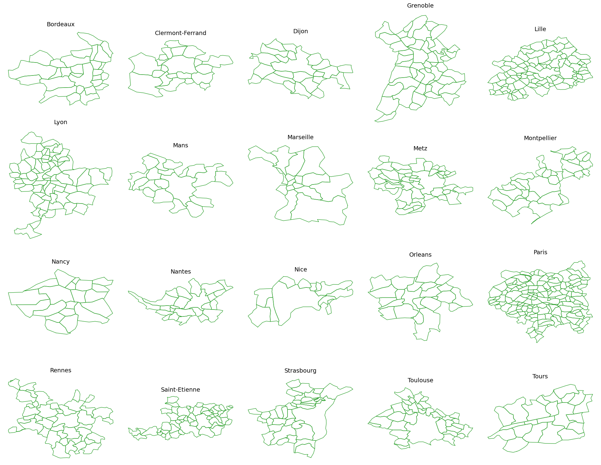
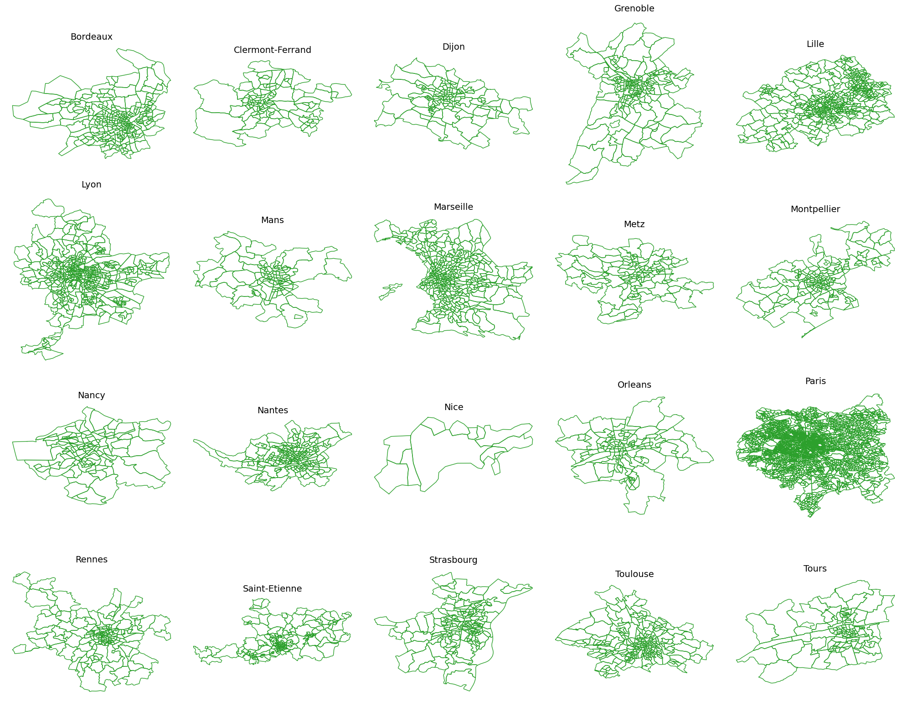
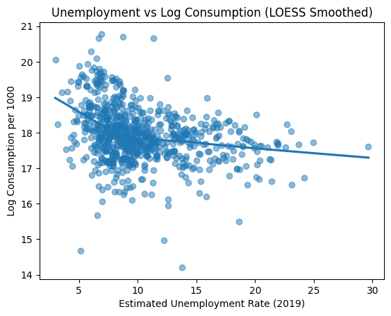
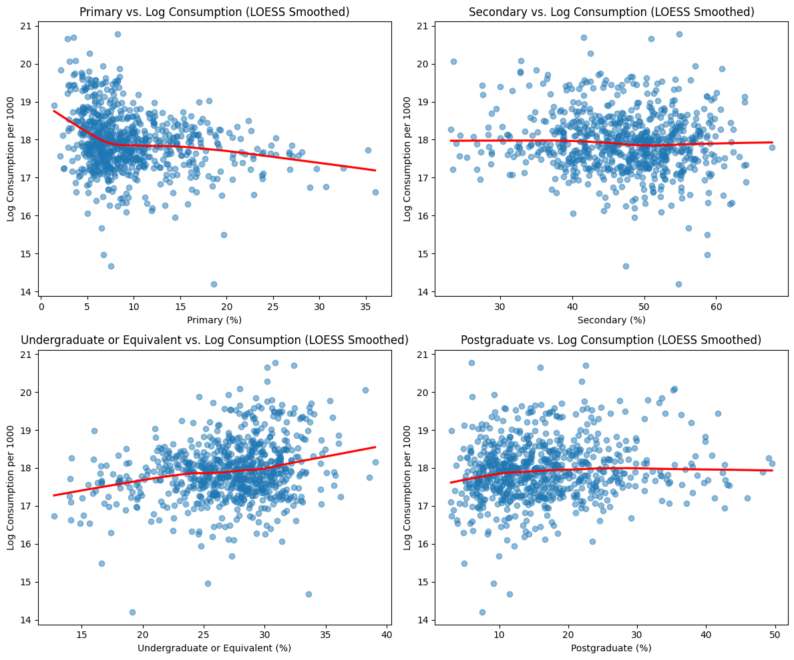
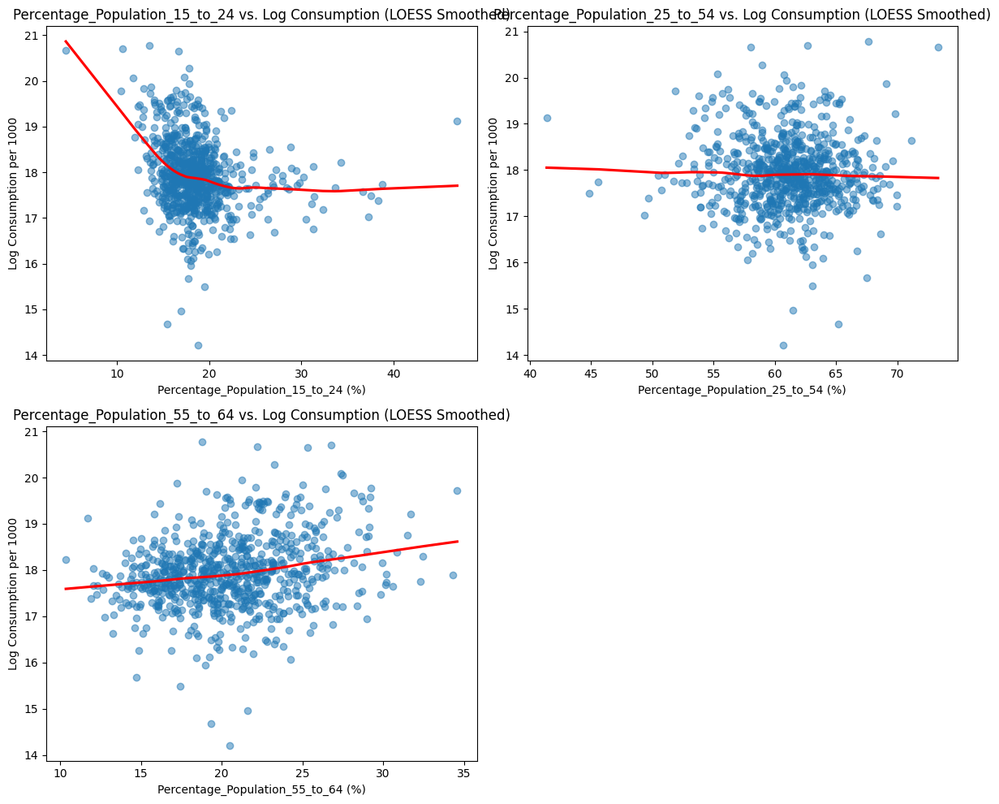

# Netmob Data Analysis
Mobile Traffic Data Analysis from NetMob23 to explore Web Adult consumption patterns across 20 French cities. It integrates demographic, temperature, and spatial data (POIs) to uncover trends in web traffic and understand regional variations in consumption behavior.

## Data Description

This project uses anonymized mobile traffic data from the <a href="https://github.com/nds-group/netmob2023challenge">NetMob23 Challenge</a>, focusing on web activity across 20 French cities. The dataset includes:

* 20 urban areas in France (Paris, Lyon, Marseille, Toulouse, Nice, etc.)
* 77 days continuous days
* Spatial Data (City Borders, Communes, IRIS)
* 100 x 100 m2 spatial resolution
* 1 Hour temporal resolution
* 14GB+ of data

Contextual Data: Temperature records and Points of Interest (POIs) were also integrated for enriched analysis.

#### Spatial Data Visualization

Left Image outlines the commune-level borders within each city. Communes represent the smallest administrative units in France. While right image highlights IRIS zones, which allow for fine-grained geographic segmentation used in demographic studies.

   
   

## Data Preprocessing

1. Cleaning & Filtering
- Removed incomplete or noisy records from mobile traffic data.
- Focused on normalized adult website visit metrics (Web_Adult_Norm).
- Filtered data to include only the 20 target French cities.

2. Spatial Mapping
- Mapped mobile network tiles to corresponding commune and IRIS zones using shapefiles.
- Merged geospatial data with traffic metrics for multi-level spatial analysis.

3. Temporal Processing
- Extracted and aligned time-series data to a consistent daily frequency.
- Integrated temperature data by city and day to enable cross-factor analysis.

4. Merging External Datasets
- Combined Points of Interest (POI) data to enrich spatial context.
- Aligned all datasets using standard geocodes and timestamps.

## Exploratory Data Analysis

Key insights include:

- Most cities showed peak activity during late evening hours (around 10 PM to midnight), with noticeably lower usage in early mornings.
- No strong or consistent correlation was found w.r.t temperature; both high and low consumption occurred across a wide range of temperatures.
- Another clear pattern emerged showing consumption increased on weekends and Fridays, while weekdays (especially Monday–Wednesday) showed lower activity.

## Socioeconomic/Demographic Factors Analysis

### 1. Unemployment Rate Analysis

- **Findings**: 
  - Moderate correlation between unemployment rate and web consumption.
  - Higher unemployment = increased adult content consumption in some communes.

### 2. Level of Education Analysis
  
 

- **Findings**:
  - Negative correlation for Primary and Secondary education levels with adult web consumption.
  - Positive correlation for Undergraduate and Postgraduate education levels, suggesting higher consumption with higher education.
  - Higher consumption is seen in areas with lower levels of education (Primary/Secondary).

### 3. Age Group Composition Analysis

 

- **Findings**:
  - None of the age brackets exhibits a strong linear association with consumption.
  - Even when combining age groups, we do not substantially improve our ability to predict adult web consumption.
