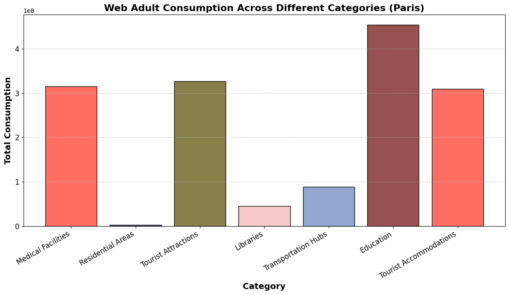

# Netmob Data Analysis
Mobile Traffic Data Analysis from NetMob23 to explore Web Adult consumption patterns across 20 French cities. It integrates demographic, temperature, and spatial data (POIs) to uncover trends in web traffic and understand regional variations in consumption behavior.

## Data Description

This project uses anonymized mobile traffic data from the <a href="https://github.com/nds-group/netmob2023challenge">NetMob23 Challenge</a>, focusing on web activity across 20 French cities. The dataset includes:

* 20 urban areas in France (Paris, Lyon, Marseille, Toulouse, Nice, etc.)
* 77 days continuous days
* Spatial Data (City Borders, Communes, IRIS)
* 100 x 100 m2 spatial resolution
* 1 Hour temporal resolution
* 14GB+ of data

Contextual Data: Temperature records and Points of Interest (POIs) were also integrated for enriched analysis.

#### Spatial Data Visualization

Left Image outlines the commune-level borders within each city. Communes represent the smallest administrative units in France. While right image highlights IRIS zones, which allow for fine-grained geographic segmentation used in demographic studies.

<p float="left">
   
   
</p>

## Data Preprocessing

1. Cleaning & Filtering
- Removed incomplete or noisy records from mobile traffic data.
- Focused on normalized adult website visit metrics (Web_Adult_Norm).
- Filtered data to include only the 20 target French cities.

2. Spatial Mapping
- Mapped mobile network tiles to corresponding commune and IRIS zones using shapefiles.
- Merged geospatial data with traffic metrics for multi-level spatial analysis.

3. Temporal Processing
- Extracted and aligned time-series data to a consistent daily frequency.
- Integrated temperature data by city and day to enable cross-factor analysis.

4. Merging External Datasets
- Combined Points of Interest (POI) data to enrich spatial context.
- Aligned all datasets using standard geocodes and timestamps.

## Exploratory Data Analysis

Key insights include:

- Most cities showed peak activity during late evening hours (around 10 PM to midnight), with noticeably lower usage in early mornings.
- No strong or consistent correlation was found w.r.t temperature; both high and low consumption occurred across a wide range of temperatures.
- Another clear pattern emerged showing consumption increased on weekends and Fridays, while weekdays (especially Monday–Wednesday) showed lower activity.

## Socioeconomic/Demographic Factors Analysis

### Unemployment Rate Analysis


- **Findings**: 
  - Moderate correlation between unemployment rate and web consumption.
  - Higher unemployment = increased adult content consumption in some communes.


### Level of Education Analysis
  
 

- **Findings**:
  - Negative correlation for Primary and Secondary education levels with adult web consumption.
  - Positive correlation for Undergraduate and Postgraduate education levels, suggesting higher consumption with higher education.
  - Higher consumption is seen in areas with lower levels of education (Primary/Secondary).

### Age Group Composition Analysis

 

- **Findings**:
  - None of the age brackets exhibits a strong linear association with consumption.
  - Even when combining age groups, we do not substantially improve our ability to predict adult web consumption.

## POIs Analysis

#### Categories of POIs Analyzed:
- **Medical Facilities**: Hospital, Clinic, Doctor, Dentist, Pharmacy, etc.
- **Residential Areas**: Apartments, Condominiums, Housing Complexes, Hostels, etc.
- **Tourist Attractions**: National Parks, Museums, Amusement Parks, Beaches, etc.
- **Libraries**: Public Libraries, University Libraries, Research Libraries, etc.
- **Transportation Hubs**: Bus Stations, Train Stations, Airports, etc.
- **Educational Locations**: Universities, Colleges, Preschools, etc.
- **Tourist Accommodations**: Hotels, Motels, Resorts, etc.

#### Key Findings:
- **Education-related locations** consistently exhibit the highest levels of adult web consumption across all observed cities.
- **Medical facilities** and **tourist accommodations** also show high consumption.
- **Residential areas** and **libraries** exhibit the lowest consumption, likely due to the use of mobile data rather than WiFi at home.
- **Transportation hubs** show moderate consumption, with fluctuations observed between cities due to differing local behaviors and infrastructure.

 

## How to Run

### 1. Clone or download the repo
To run the project, first, clone or download the repsitory, then get the required dataset. The data used in this project comes from the <a href="https://github.com/nds-group/netmob2023challenge">NetMob23 Challenge</a> and access to it is strictly restricted. Only approved participants will be granted access under the terms and conditions specified by the organizers.

You will also need auxiliary datasets such as:

- INSEE demographic and socioeconomic data for French communes (publicly available)
- Weather/temperature data for French cities (e.g., via Open-Meteo or similar APIs)

### 2. Project Structure
Before running the notebook, ensure your project folder is structured as follows:

```
/project_directory/
│-- data/                    # Downloaded dataset directory
│-- main.ipynb               # Jupyter Notebook for analysis
│-- requirements.txt         # Required dependencies
│-- README.md                # Project documentation
```

### 3. Install Requirements
Ensure you have **Python 3.12** installed. Then, install the required dependencies by running:

```bash
pip install -r requirements.txt
```

### 4. Run the Notebook
Once the dependencies are installed and the data is in place, you can open and use the notebook as needed:

```bash
jupyter notebook "main.ipynb"
```

## Authors

- **Syed Mohammed Khalid** – syyy00001@stud.uni-saarland.de
- **Prakhar Narain Srivastava** – prsr00001@stud.uni-saarland.de
- **Chaitanya Rajeshbhai Jobanputra** – chjo00006@stud.uni-saarland.de
