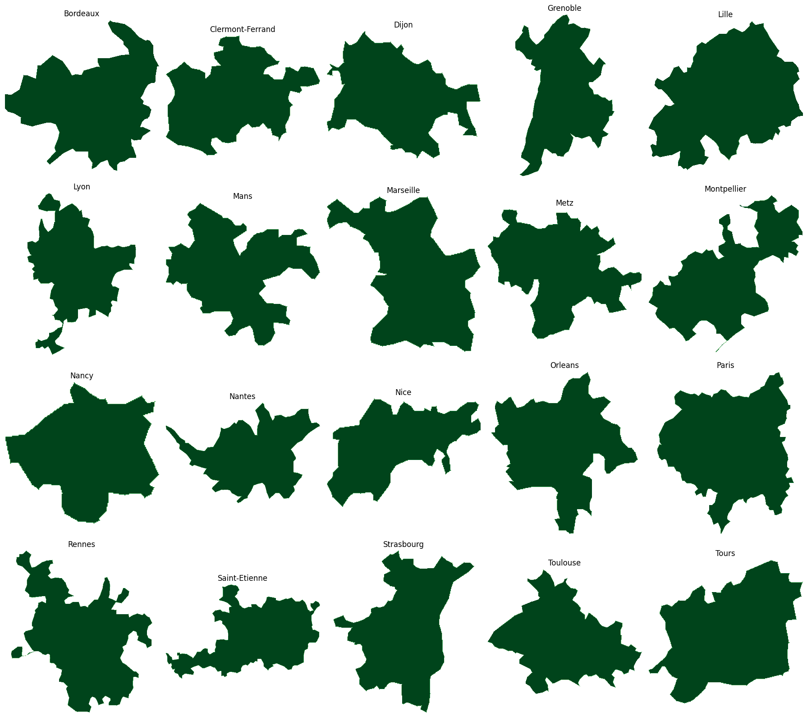

# NetmobDataAnalysis
Mobile Traffic Data Analysis from NetMob23 to explore Web Adult consumption patterns across 20 French cities. It integrates demographic, temperature, and spatial data (POIs) to uncover trends in web traffic and understand regional variations in consumption behavior.

## Data Description

This project uses anonymized mobile traffic data from the <a href="https://github.com/nds-group/netmob2023challenge">NetMob23 Challenge</a>, focusing on web activity across 20 French cities. The dataset includes:

* 20 urban areas in France (Paris, Lyon, Marseille, Toulouse, Nice, etc.)
* 77 days continuous days
* Spatial Data (City Borders, Communes, IRIS)
* 100 x 100 m2 spatial resolution
* 1 Hour temporal resolution
* 14GB+ of data

Contextual Data: Temperature records and Points of Interest (POIs) were also integrated for enriched analysis.

#### Spatial Data Visualization

 
